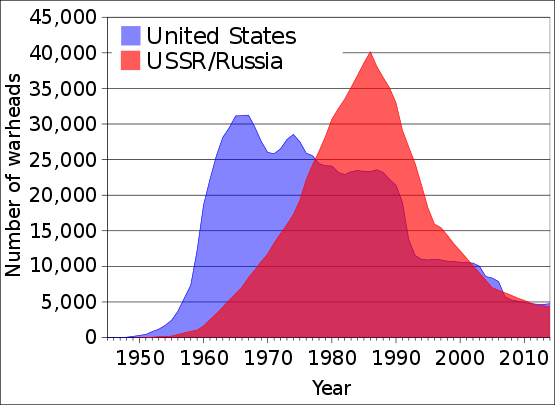
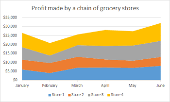
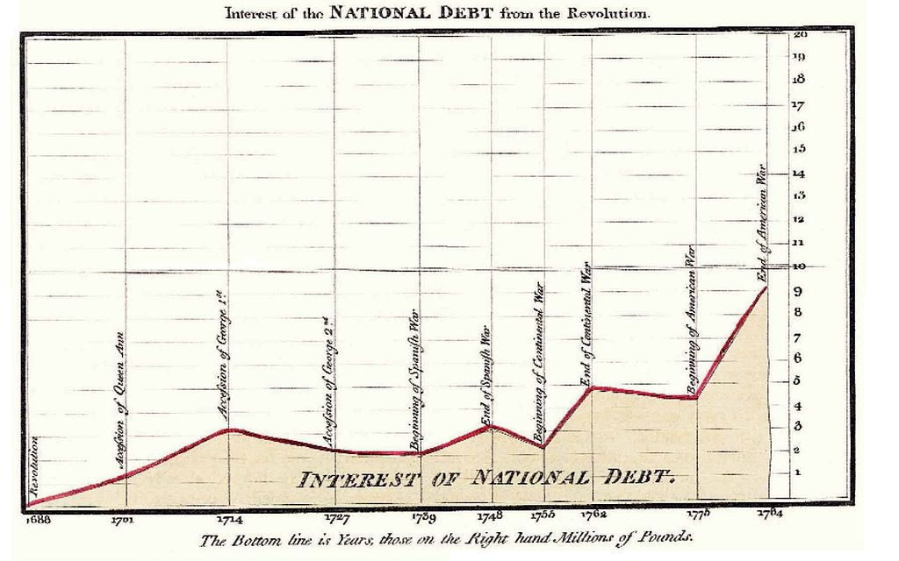
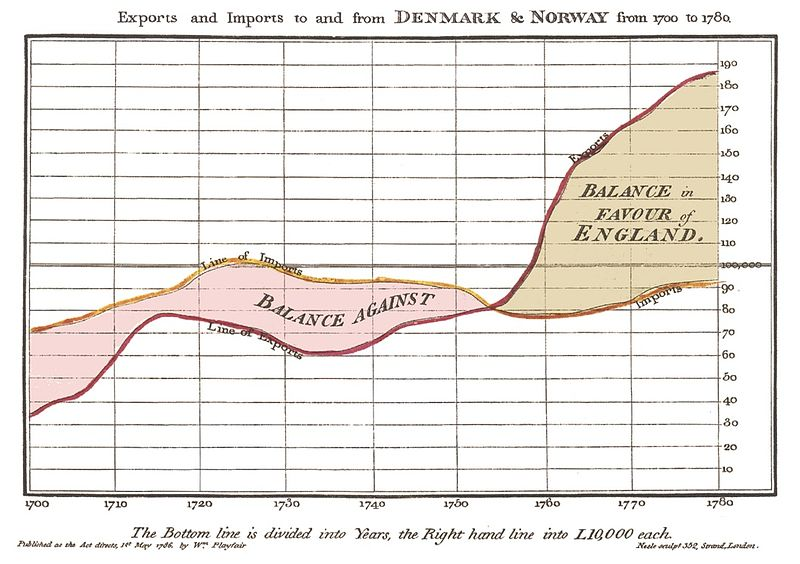

# Compte-rendu 1 : Area chart

## Présentation
Le area chart, ou diagramme de zone en français, est similaire à un graphique en lignes, en cela qu'il relie chaque valeur par des segments, mais il colorie la zone entre la courbe et l'axe x. Il met en valeur la tendance, mais ne met pas l'accent sur la précision des valeurs.

<table border="0">
  <tr>
    <td>
      
    </td>
  </tr>
  <tr>
    <td align="center">
      Un area chart, montrant ici l'évolution du nombre de têtes nucléaires de l'URSS et des USA[1]
    </td>
  </tr>
</table>

Un type d'area chart très souvent utilisé est le stacked area chart, ou diagramme en zones superposées ou empilées. Il consiste en la superposition des diagrammes de zone de plusieurs catalogues, comme ci-dessous. Il est très utile pour comparer plusieurs catalogues et surtout leurs tendances.

<table border="0">
  <tr>
    <td>
      
    </td>
  </tr>
  <tr>
    <td align="center">
      Exemple de stacked area chart représentant le profit de plusieurs magasins.[2]
    </td>
  </tr>
</table>

On voit ici bien l'apport et l'évolution de chaque catalogue.

## Exemples célèbres

Egalement crédité des premiers diagrammes en lignes, barres et camembert, on considère William Playfair est le premier à introduire le area chart dans un livre de 1786.[3]
En voici quelques exemples.

### Interest of the National Debt from the Revolution

Une première est Interest of the National Debt from the Revolution. Celle-ci met en exergue l'augmentation de la dette nationale suite à la Glorieuse Revolution de 1688 en Angleterre.

<table border="0">
  <tr>
    <td>
      
    </td>
  </tr>
  <tr>
    <td align="center">
      Interest of the National Debt from the Revolution, William Playfair.[4]
    </td>
  </tr>
</table>

### Exports and imports to and from Denmark & Norway from 1700 to 1780

Ce graphique représente la balance commerciale de l'Angleterre avec le Danemark et la Norvège. En colorant la zone entre la courbe des importations et celle des exportations, Playfair rend ainsi particulièrement visible le caractère bénéficiaire ou déficitaire de cette balance commerciale, ainsi que son évolution.

<table border="0">
  <tr>
    <td>
      
    </td>
  </tr>
  <tr>
    <td align="center">
      Exports and imports to and from Denmark & Norway from 1700 to 1780, William Playfair.[4]
    </td>
  </tr>
</table>

## Sources

* [1] US and USSR nuclear stockpiles : https://en.wikipedia.org/wiki/Area_chart#/media/File:US_and_USSR_nuclear_stockpiles.svg
* [2] Stacked area Chart Example : https://study.com/academy/lesson/what-is-an-area-chart-definition-examples.html
* [3] Article area chart : https://en.wikipedia.org/wiki/Area_chart* [4] Interest of the National Debt from the Revolution : https://en.wikipedia.org/wiki/File:1786_Playfair_-_25_Interest_of_the_national_Debt_from_the_Revolution.jpg
* [4] Interest of the National Debt from the Revolution : https://en.wikipedia.org/wiki/File:1786_Playfair_-_25_Interest_of_the_national_Debt_from_the_Revolution.jpg
* [5] Exports and imports to and from Denmark & Norway from 1700 to 1780 : https://en.wikipedia.org/wiki/File:1786_Playfair_-_12_Exports_and_imports_to_and_from_Denmark_%26_Norway_from_1700_to_1780.jpg
